# Zookeeper 入门

## 1. 概述

Zookeeper 是一个开源的分布式的，为分布式框架提供协调服务的 Apache 项目

## 2. 特点

1. 一个 Leader，多个 Follower 组成的集群
2. 集群中只要有半数以上节点存活，Zookeeper 集群就能正常服务。所以 Zookeeper 适合**奇数台服务器**
3. 全局数据一致：每个 Server 保存一份相同的数据副本，Client 无论连接到哪个 Server，数据都是一致的
4. 更新请求顺序执行，来自同一个 Client 的更新请求按其发送顺序执行
5. 数据更新的原子性，实时性（一定时间范围内，Client一定能读到最新数据）

## 3. 数据结构

Zookeeper 数据模型的结构与 Unix 文件系统很类似，整体上可以看做是一颗树，每个节点称做一个`ZNode`，每一个 ZNode 默认能够存储 1MB 的数据，每个 ZNode 都可以通过其路径唯一标识

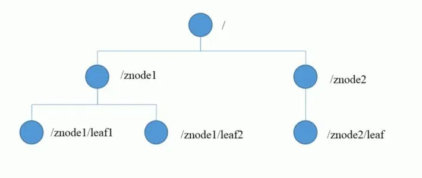

## 4. 应用场景

提供的服务包括：统一命名服务、统一配置服务、统一集群管理、服务节点动态上下线、软负载均衡等

### 4.1 统一命名服务

在分布式环境下，经常需要对应用/服务进行统一命名，以便于识别。

与nacos对服务命名类似，都是为了容易识别。

### 4.2 统一配置服务

分布式环境下，配置文件同步非常的常见。一般要求一个集群中，所有节点的配置信息是一致的，比如 Kafka 集群。对配置文件修改后，希望能快速同步到各个节点上。

配置管理可以交给 Zookeeper 来实现，可以将配置信息写入 Zookeeper 的 ZNode 上，客户端服务器都去监听这个 ZNode，一旦 ZNode 中的数据被修改，Zookeeper 将通知各个客户端服务器

### 4.3 统一集群管理

分布式环境中，实时掌握每个节点的状态是必要的。可以根据节点的实时状态做出一些调整。

Zookeeper 可以实现监控节点状态变化，可以将节点信息写入到 Zookeeper 的一个 ZNode 上，监听这个 ZNode 即可获取它的实时状态变化

### 4.4 服务动态上下线

客户端以及服务之间可以实时洞察到服务的的上下线

### 4.5 软负载均衡

在 Zookeeper 中记录每台服务器的访问数，可以让访问数最少的服务去处理最新的客户端请求

# Zookeeper 安装

## 1. 本地、集群安装

用 docker-compose，又快又方便~

```bash
docker-compose up -d
```

## 2. 配置文件参数

LF：Leader and Follower

```bash
tickTime=2000   # Zookeeper服务器与客户端的通信心跳时间，单位毫秒
initLimit=10    # LF初始通信时限
syncLimit=5     # LF同步通信时限
dataDir:        # 保存Zookeeper中的数据
clientPort=2181 # 客户端连接端口，通常不做修改
```

# Zookeeper 集群

## 1. 选举机制

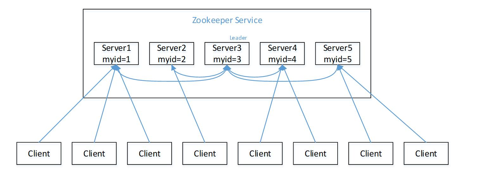

### 第一次启动

1. Server1 启动，发动一次选举，投自己一票，不够半数以上（3票），选举无法完成，Server1 保持状态为 LOOKING
2. Server2 启动，再发起一次选举，此时 Server1 发现 Server2 的比目前投票自己推举的服务器（Server1）大，更改选票为 Server2，此时 Server2 拥有两票，选举仍然无法完成，Server1, 2 保持 LOOKING
3. Server3 启动，再发起一次选举，此时 Server1 和 Server2 都会更改选票为 Server3，Server3 超过半数选为 Leader，Server1, 2 状态改为 Follower
4. Server4 启动，再发起一次选举，此时 Server1, 2, 3 都不是 LOOKING 状态所以不会更改投票信息，Server4 为 1 票，服从 3 票的 Server3
5. Server5 启动，结果与 Server4 一样

### 非第一次启动

当 Zookeeper 集群中的一台服务器出现以下两种情况之一时，就会进入 Leader 选举

* 服务器初始化启动

* 服务器运行期间无法和 Leader 保持连接

当另一台服务器进入 Leader 选举流程时，当前集群也可能会处于以下两种情况

* 集群中已存在 Leader

  服务器识图去选举 Leader时，会被告知服务器 Leader 信息，对于该服务器而言，仅仅需要和 Leader 服务器建立连接同步状态即可

* 服务中不存在 Leader

  先说明三个概念：**SID**：服务器 ID，唯一标识，和myid一致

  **ZXID**：事务 ID，标识一次服务器状态的变更

  **Epoch**：每个 Leader 任期的代号

  假设 Zookeeper 五台服务器 SID 分别是1, 2, 3, 4, 5，ZXID 分别是 8, 8, 8, 7, 7，此时 SID 为 3 的 服务器是 Leader，某一时刻 3 和 5 出现了故障，因此开始进行选举

  服务器 1, 2, 4 的投票情况（Epoch, ZXID, SID）：(1, 8, 1), (1, 8, 2), (1, 7, 4)

  规则为：Epoch 大的胜出。Epoch 相同，则 ZXID 大的胜出，否则 SID 大的胜出

  那么我们可以知道，服务器 2 胜出

# 客户端操作

## 1. 命令行语法

| 命令行基本语法 |                           功能描述                           |
| :------------: | :----------------------------------------------------------: |
|      help      |                       显示所有操作命令                       |
|    ls path     | 查看 znode 的子节点<br />-w: 监听子节点变化，-s: 附加次级信息 |
|     create     | 创建普通节点<br />-s: 含有序列，-e: 临时节点(重启或超时消失) |
|    get path    |  获得节点的值<br />-w: 监听节点的内容变化，-s: 附加次级信息  |
|      set       |                       设置节点的具体值                       |
|      stat      |                         查看节点状态                         |
|     delete     |                           删除节点                           |
|   deleteall    |                         递归删除节点                         |

## 2. ZNode 节点数据信息

1. cZxid: 创建节点的事务id。每次修改都会产生一个事务id，有次序关系。
2. ctime: ZNode 被创建的毫秒数（从 1970 年开始）
3. mZxid: ZNode 最后更新的事务 Zxid
4. mtime: ZNode 最后修改的毫秒数
5. pZxid: ZNode 最后更新的子节点 Zxid
6. cversion: ZNode 子节点变化号，ZNode 子节点修改次数
7. dataVersion: ZNode 数据变化号
8. aclVersion: 访问控制列表的变化号
9. ephemeralOwner: 如果是临时节点，则为 ZNode 拥有者的 session id。如果不是则为 0
10. dataLength: ZNode 的数据长度
11. numChildren: ZNode 子节点数量

## 3. 节点类型

持久化目录节点: 客户端与服务端断开后，该节点依然存在

持久化顺序编号目录节点: 断开后，节点依然存在，只是 Zookeeper 给该节点名称顺序编号

临时目录节点: 断开后，节点被自动删除

临时顺序编号目录节点: 断开后，节点别自动删除，只是 Zookeeper 给该节点名称进行顺序编号

创建 ZNode 时设置顺序标识，ZNode 名称后面会附加一个值，顺序号是一个单调递增的计数器，由父节点维护

> 在分布式系统中，顺序号可以被用于所有的事件进行全局排序，这样客户端可以通过顺序号推断事件的顺序

## 4. 监听器原理

客户端注册监听它关心的目录节点，当目录节点发生变化（数据改变，节点删除，子目录节点增加删除等）时，Zookeeper 会通知客户端。监听机制保证 Zookeeper 保存的任何数据的任何改变都能快速响应到应用程序。

### 原理详解

1. 首先有一个 main 线程
2. main 线程中创建 Zookeeper 客户端，这时就会创建两个线程，一个负责网络通信（connect），一个负责监听（listener）
3. 通过 connect 线程将注册的监听事件发送给 Zookeeper
4. 将注册的监听事件添加到 Zookeeper 的注册监听器列表中
5. Zookeeper 监听到有数据或路径变化，就会将这个消息发送给 listener线程
6. listener 线程内部调用 process方法，通知每个节点

### 常见的监听

1. 监听节点数据的变化：get -w PATH
2. 监听子节点增减的变化：ls -w PATH

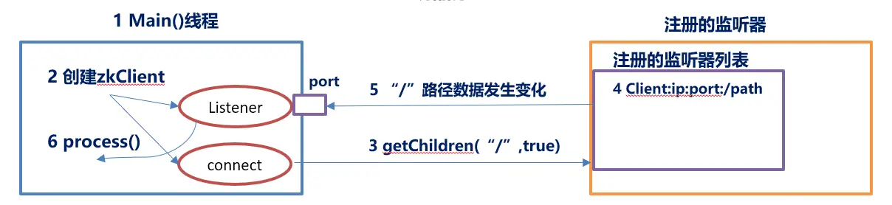

> 监听节点只会注册一次，也就是只会生效一次，如果需要再次监听，则需重新注册

## 5. 写数据流程

### 写入请求发送给 Leader

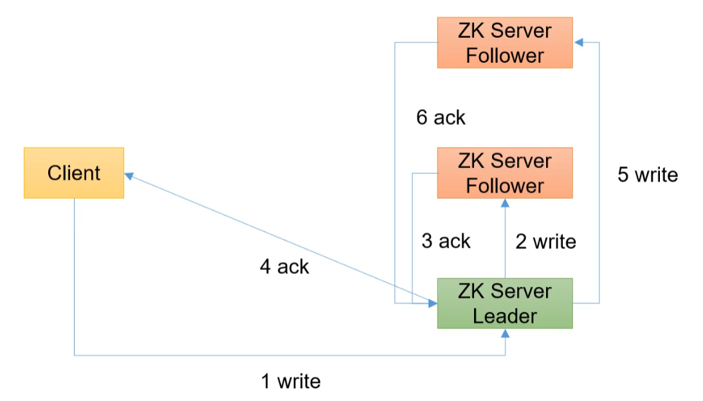

### 写入请求发送给 follower

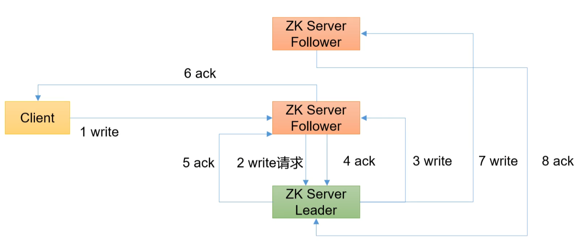

# 服务动态上下线

## 1. 需求

某分布式系统中，主节点可以有多台，可以动态上下线，任意一台客户端都能实时感知到主节点服务的上下线

## 2. 需求分析

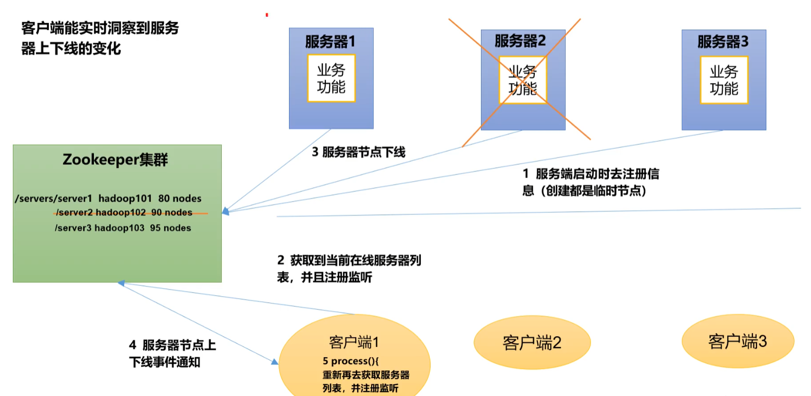

## 3. 具体实现

1. 现在集群上创建 /servers 节点

```bash
create /servers "servers'
```

2. 编写服务器以及客户端代码

# Zookeeper 分布式锁

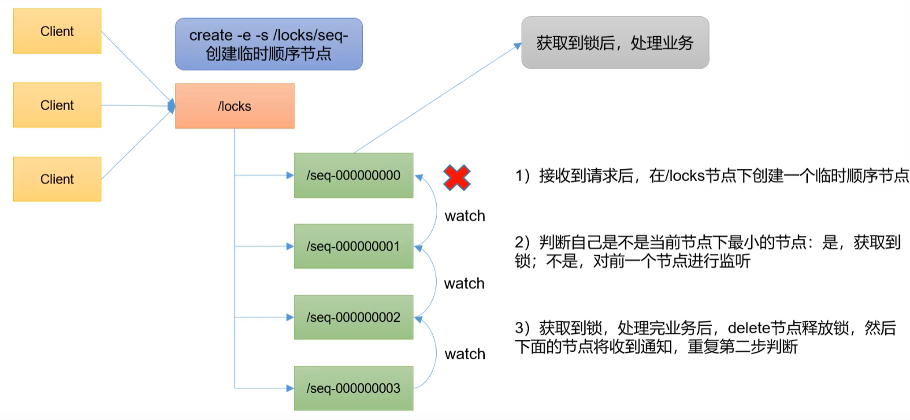

可以使用成熟的 Zookeeper 分布式锁框架`Curator`

# 面试题

## 1. 选举机制

Zookeeper 采用半数机制，超过半数的投票通过成为 Leader

1. 第一次选举规则：投票过半数时，服务器 id 大的胜出
2. 第二次选举规则：
   1. Epoch 大的直接胜出
   2. Epoch 相同，事务 id 大的胜出
   3. 事务 id 相同，服务器 id 大的胜出

## 2. 生产集群装多少台 Zk 合适

首先选举机制为了防止脑裂安装奇数台

生产环境经验：

* 10 台服务器：3 台 Zk
* 20 台服务器：5 台 Zk
* 100 台以上服务器：11 台 Zk

服务器越多，好处是提高可靠性，坏处是提高通信延迟

# Zookeeper 算法基础

> Zookeeper 如何保证数据一致性？这也是困扰分布式系统框架的一个难题

## 1.  Paxos 算法

一种基于消息传递且具有高度容错特性的一致性算法

解决的问题：快速正确的在一个分布式系统中对某个数据达成一致，并且保证无论发生任何异常，都不会破坏整个系统的一致性

在一个 Paxos 系统中，首先将所有节点划分成 Proposer（提议者），Acceptor（接受者）和 Learner（学习者）。

**一个完整的 Paxos 算法分为以下几个阶段**：

1. Prepare 准备阶段
   1. Proposer 向多个 Acceptor 发出 Propose 请求 Promise
   2. Acceptor 针对收到的 Propose 请求进行 Promise
2. Accept 接受阶段
   1. Proposer 收到多数 Acceptor 承诺的 Promise 后，向 Acceptor 发出 Propose 请求
   2. Acceptor 针对收到的 Propose 请求进行 Accept 处理
3. Learn 学习阶段
   1. Proposer 将形成的决议发送给所有 Learners

**流程**：

1. Prepare：Proposer 生成全局唯一且递增的 Proposal ID，向所有 Accptor 发送 Propose 请求，这里无需携带提案内容，只携带 Proposal ID 即可
2. Promise：Accptor 收到 Propose 请求后，做出"两个承诺，一个应答"
   * 不再接受 Proposal ID **小于等于**当前请求的 Propose 请求
   * 不再接受 Proposal ID **小于**当前请求的 Accept 请求
   * 不违背之前做出的承诺下，回复已经 Accept 过的提案中 Proposal ID 最大的那个提案的 Value 和 Proposal ID，没有则返回空值
3. Propose：Proposer 收到多数的 Acceptor 的 Promise 应答后，从应答中选择 Proposal ID 最大的提案的 Value，作为本次要发起的提案。如果所有应答的提案 Value 均为空值，则可以自己随意决定提案 Value。然后携带当前 Proposal ID，向所有 Acceptor 发送 Propose 请求
4. Accept：Acceptor 收到 Propose 请求后，在不违背之前做出的承诺下，接受并持久化当前 Proposal ID 和提案 Value
5. Learn：Proposer 收到多数 Acceptor 的 Accept 后，决议形成，将形成的决议发送给所有 Learner。

Paxos 算法缺陷：在网络复杂的情况下，有可能无法收敛，甚至陷入活锁的情况。系统中有一个以上的 Proposer，多个 Proposer 相互争夺 Acceptor，造成迟迟无法达成一致的情况。

针对这种情况，一种改进的 Paxos 算法被提出：从系统中选出一个节点作为 Leader，只有 Leader 能够发起提案。这样 Paxos 流程中就只会有一个 Proposer，不会出现活锁的情况

## 2. ZAB 协议

## 2.1 ZAB 算法

ZAB 借鉴了 Paxos 算法，是特别为 Zookeeper 设计的支持崩溃恢复的原子广播协议。基于该协议，Zookeeper 设计为只有一台服务器（Leader）负责处理外部的写事务请求，然后 Leader 服务器将数据同步到其他 Follower 节点。即 Zookeeper 只有一个 Leader 可以发起提案。

## 2.2 ZAB 协议内容

ZAB 协议包括两种基本模式：消息广播、崩溃恢复

消息广播：

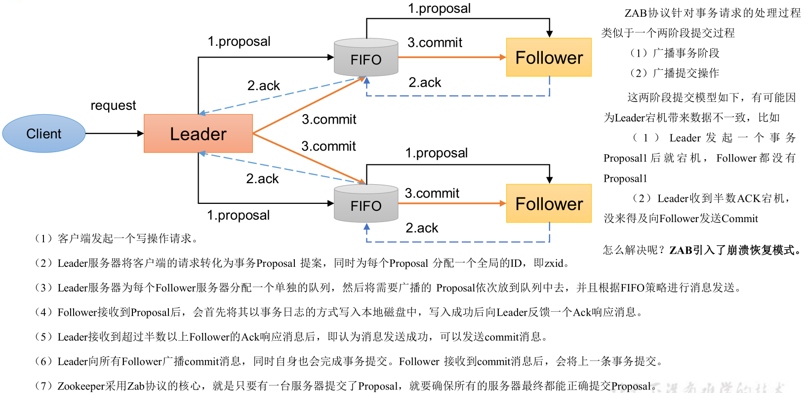

崩溃恢复：一旦 Leader 服务器出现崩溃或者由于网络原因导致 Leader 服务器失去了与过半 Follower 的联系，就会进入崩溃恢复模式

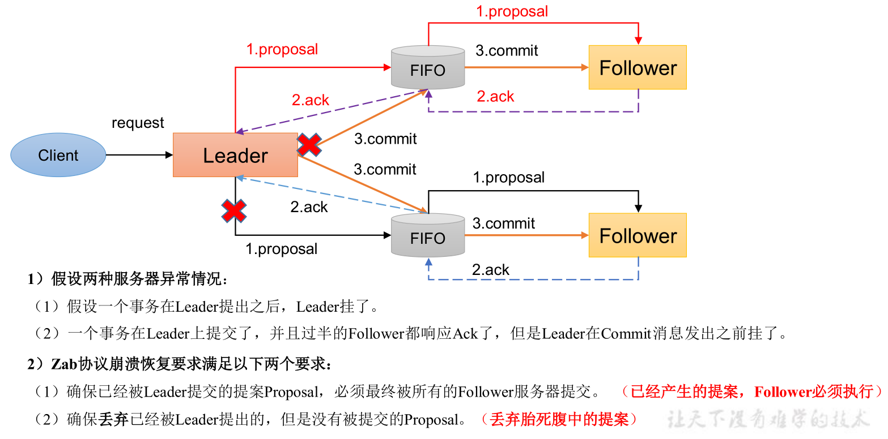

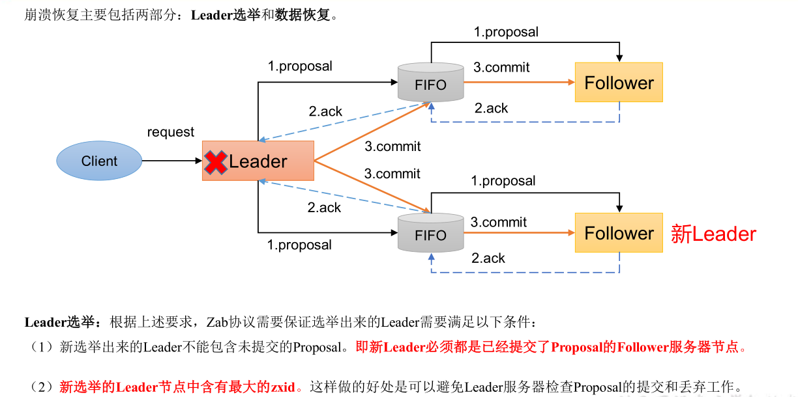

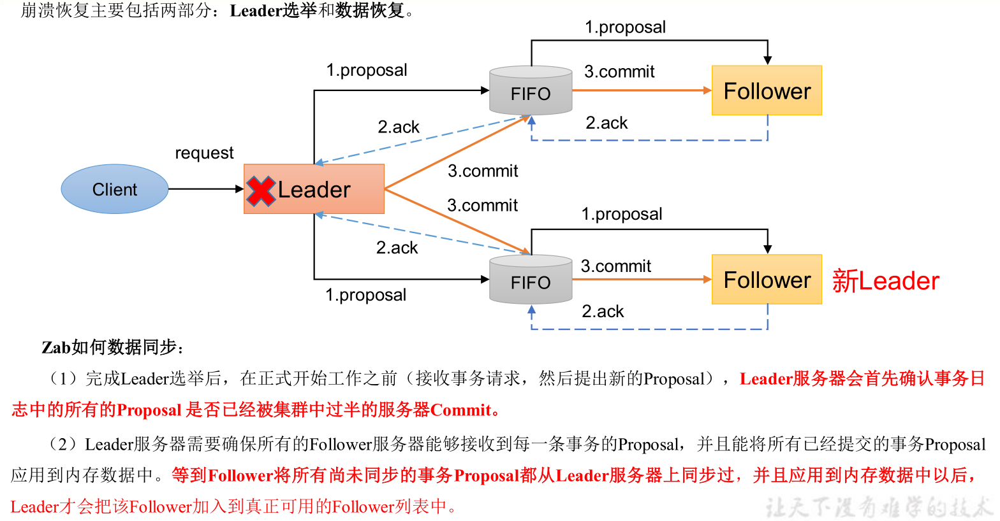

# CAP 理论

CAP 理论告诉我们，一个分布式系统不可能同时满足以下三种

* 一致性（Consistency）
* 可用性（Available）
* 分区容错性（Partition Tolerance）

这三个基本需求只能满足两个，其中**分布式系统**中 P 是必须的，因此往往选择在 CP 或者 AP 中

**Zookeeper 保证的是 CP**，因此

1. Zookeeper 不能保证每次服务请求的可用性
2. 进行 Leader 选举时集群是不可用的